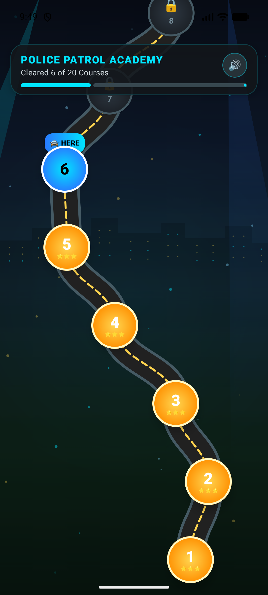
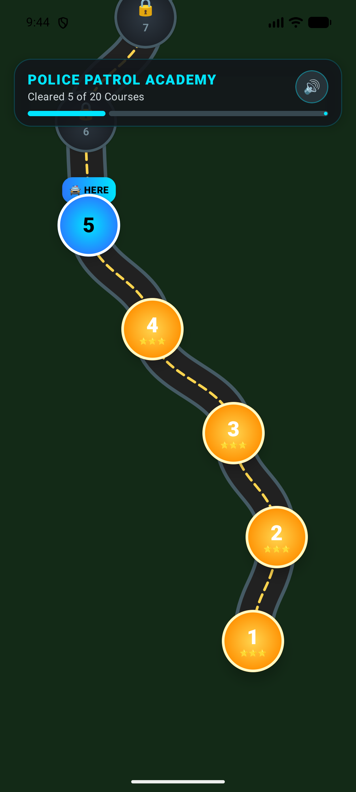
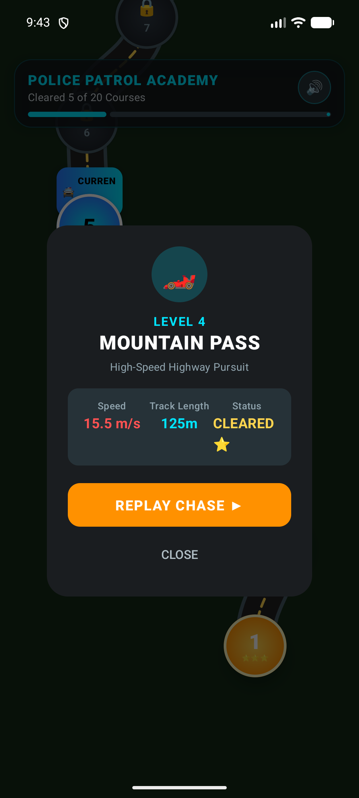
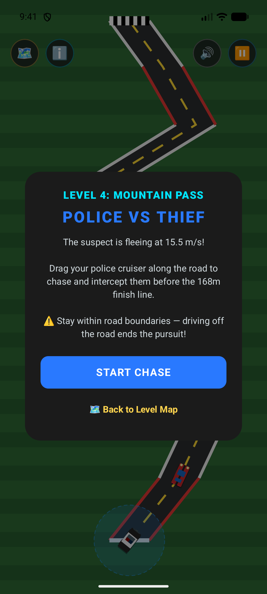
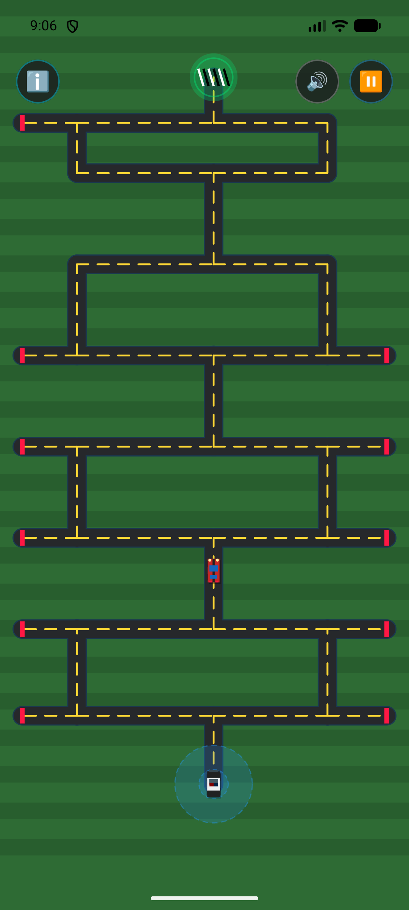

# 🚨 Police vs Thief (Android)

<p align="center">
  
</p>

<p align="center">
  <strong>A high-octane tactical pursuit & labyrinth puzzle game built with modern Android, Jetpack Compose, and custom 2D physics.</strong>
</p>

<p align="center">
  
  
  
  
  
  
  
</p>

---

## 🎮 Game Overview

**Police vs Thief** is an intense tactical interceptor game where you commandeer a high-speed police cruiser to pursue and trap fleeing suspects before they escape across the finish line or slip out of the city through labyrinthine corridors.

The game features **20 escalating levels** divided into two distinct gameplay phases:

1. **Phase 1: High-Speed Highway Pursuits (Levels 1–10)**  
   Dynamic curving highways with narrowing road shoulders (12m down to 6m), accelerating suspect vehicles (8 m/s up to 31 m/s), and increasing road lengths (80m to 220m).
2. **Phase 2: Tactical Pac-Man Labyrinths (Levels 11–20)**  
   Complex multi-path puzzle mazes featuring atomic corridor networks (12 to 40 corridors), deceptive dead-end cul-de-sacs with barricades, high suspect speeds (up to 56 m/s), and Dijkstra shortest-path pathfinding AI.

---

## 📸 Visual Showcase

| 🗺️ Candy Crush Progression Ladder | 📋 Mission Briefing Intel |
| :---: | :---: |
|  |  |
| *Winding serpentine road with animated night sky, sweeping police searchlights, and level nodes.* | *Course telemetry, suspect speed, road length, and instant replay options.* |

| 🏎️ Phase 1: Highway Pursuit | 🧩 Phase 2: Pac-Man Maze (Level 20) |
| :---: | :---: |
|  |  |
| *High-speed highway intercept with dynamic HUD, drag-to-steer controls, and boundary physics.* | *40-corridor Mastermind Maze with dead-end barricades and multi-route interception.* |

---

## ✨ Key Features

### 🗺️ Candy Crush-Style Level Progression Ladder
- **Serpentine Road Path**: A custom-drawn winding asphalt road with dashed yellow dividers snaking upward from Level 1 (bottom) to Level 20 (summit).
- **Auto-Centering Viewport**: Automatically scrolls and centers on the player's active level upon launch.
- **Node States**:
  - **Completed Levels** (⭐⭐⭐): Radiant gold badges displaying level numbers and 3 completion stars. Fully unlocked and replayable at any time.
  - **Current Level** (`🚔 HERE`): Vibrant neon cyan pulsing badge with a floating patrol indicator.
  - **Locked Levels** (🔒): Dark slate nodes marked with padlocks. Cannot be accessed until all preceding levels are cleared.
- **Atmospheric Background Animation**:
  - Deep vertical sky gradient (Cyber Midnight $\to$ Outskirts Forest Floor).
  - Distant skyline silhouettes with glowing illuminated windows.
  - Two animated volumetric police searchlights sweeping across the sky.
  - 32 floating bioluminescent light motes and city bokeh drifting upward.

### 🕹️ Precision Drag-to-Steer Controls
- **Pick-Up Gesture Resumption**: The cruiser only responds when the touch gesture begins within the vehicle's grab target. Tapping elsewhere on the screen does not teleport the car.
- **20dp Bottom Safety Padding**: Prevents the cruiser from clipping behind system navigation bars or gesture pills.
- **Boundary Tolerance & Crash Detection**: Precise spatial boundary checking with adaptive tolerances ($0.6\text{m}$ for highways, $1.2\text{m}$ for tight maze turns) to avoid false off-road triggers during fast cornering.

### 🔊 Dynamic Siren Audio System
- Synthesized siren audio powered by `ToneGenerator` and `AudioTrack`.
- Plays **only** when actively chasing the suspect (stops during menus, pauses, and when stationary).
- Instant HUD toggle to mute/unmute audio on the fly.

---

## 🛠️ Architecture & Technical Highlights

This project was engineered following modern Android development best practices, featuring 100% Jetpack Compose, clean separation of concerns, and custom 2D math:

```
com.example.policetheifgame/
├── game/
│   ├── audio/           # Low-latency synthesized siren sound manager
│   │   └── SirenSoundManager.kt
│   ├── data/            # SharedPreferences persistence layer
│   │   └── GamePreferences.kt
│   ├── engine/          # Pure Kotlin game physics loop & collision detection
│   │   └── GameEngine.kt
│   ├── geometry/        # 2D spatial math, viewport transforms, levels catalog
│   │   ├── GameViewport.kt
│   │   ├── LevelData.kt
│   │   ├── LevelRepository.kt
│   │   └── RoadGeometry.kt
│   └── model/           # Immutable domain models & state snapshots
│       ├── GameState.kt
│       └── Point2D.kt
└── ui/
    ├── AppScreen.kt     # Top-level screen navigation enum
    ├── GameScreen.kt    # Compose gameplay screen binding Canvas, HUD, & Dialogs
    ├── GameViewModel.kt # MVI ViewModel emitting StateFlow<GameState>
    ├── LevelMapScreen.kt# Candy Crush-style progression ladder with Canvas animations
    ├── components/      # Modular UI components (Canvas, HUD, Dialogs, Tooltips)
    └── theme/           # Material 3 color schemes, typography, and styles
```

### 1. 100% Jetpack Compose & Custom 2D Canvas
- **Zero XML Layouts**: The entire user interface, HUD overlays, dialogs, and game canvases are built declaratively with Jetpack Compose and Material 3.
- **Custom 2D Rendering Engine**:
  - `GameCanvas.kt`: Procedurally tessellates roads, asphalt shoulders, dashed lane dividers, dead-end warning barricades, checkered finish lines, and vehicle sprites.
  - `AnimatedLevelMapBackground`: GPU-accelerated drawing pass featuring sweeping volumetric searchlight cones (`Brush.radialGradient`), building window arrays, and sinusoidal particle drift running at 60 FPS without recomposition overhead.

### 2. MVI / Unidirectional Data Flow (UDF)
- The UI observes an immutable `StateFlow<GameState>` and `StateFlow<AppScreen>`.
- User interactions (drags, taps, pauses, level selections) are processed as discrete intent events by `GameViewModel`.
- `GameEngine` runs decoupled from Android framework dependencies, enabling pure JVM testing.

### 3. Custom 2D Physics & Coordinate Systems
- **World $\leftrightarrow$ Screen Viewport Transformations** (`GameViewport.kt`): Converts real-world metric coordinates (meters, speeds in m/s) into canvas pixels dynamically adapting to any device screen resolution and aspect ratio.
- **Spatial Collision & Boundary Math** (`RoadGeometry.kt`): Uses point-to-segment orthogonal distance projections and corridor bounding box containment.
- **Fixed-Timestep Simulation Loop**: Physics updates calculate displacement using delta-time ($\Delta t$) clamping in a background Coroutine (`Dispatchers.Default`) to guarantee deterministic movement across devices.

### 4. Graph Theory & Dijkstra Pathfinding
- In puzzle levels (11–20), corridors are structured as an atomic graph connecting exact $(x, y)$ intersection nodes.
- Suspect vehicles navigate the maze using **Dijkstra's shortest path algorithm**, strictly adhering to road centerlines without cutting across grass margins.
- Staggered column layouts ($\le 50\text{m}$ max vertical run) eliminate straight-line bypasses, requiring tactical navigation through intersections.

---

## 🧪 Automated Testing & Verification

The project includes **34 automated JVM unit tests** (`app/src/test/`):

```bash
./gradlew test
```

### Key Test Suites:
- **`GameEngineTest.kt`**:
  - $\Delta t$ distance physics (e.g. thief traveling exactly 10m in 1.0s).
  - Catch distance thresholds and interception triggers.
  - Off-road ditch collision boundaries.
  - Siren activation/deactivation states.
  - App launch into `AppScreen.LEVEL_MAP`.
  - Sequential unlocking enforcement (e.g. Level 8 locked while on Level 7; Level 4 unlocked and replayable).
- **`LevelDataTest.kt`**:
  - JSON asset parsing for all 20 levels.
  - Zero-tolerance containment: Asserts that `policeStartPosition`, `thiefStartPosition`, `destinationPosition`, and all `thiefRoute` waypoints are **100% on the road corridors** (`tolerance = 0.0f`).
  - Speed scaling and corridor counts ($12 \to 40$ corridors).

---

## 🚀 Tech Stack

| Technology | Purpose |
| :--- | :--- |
| **Kotlin 2.2.10** | Core programming language |
| **Jetpack Compose** | Declarative UI framework & custom 2D Canvas rendering |
| **Material 3** | Modern dialogs, typography, and color tokens |
| **Kotlin Coroutines & Flow** | Concurrency, 60 FPS physics loop, and reactive `StateFlow` |
| **Android Architecture Components** | `ViewModel`, `LifecycleRuntimeKtx` |
| **Gradle (Kotlin DSL)** | Build system with Version Catalog (`libs.versions.toml`) |
| **JUnit 4 & Coroutines Test** | Unit testing suite |

---

## 💻 Getting Started

### Prerequisites
- Android Studio Meerkat (or newer)
- JDK 11 or higher
- Android SDK 36 (compileSdk 36)
- An Android device or emulator running Android 7.0 (API level 24) or higher

### Installation
1. Open the project in Android Studio:
   ```bash
   # Open Android Studio and select File > Open > PoliceTheifGame
   ```
2. Build and run unit tests:
   ```bash
   ./gradlew test
   ```
3. Assemble the debug APK:
   ```bash
   ./gradlew assembleDebug
   ```
4. Install and run on your connected device/emulator:
   ```bash
   ./gradlew installDebug
   ```

---

## 👨‍💻 Author

Developed with ❤️ by **Divyanshu Mishra**  
*Demonstrating modern Android architecture, Jetpack Compose 2D game rendering, and custom physics simulation.*
